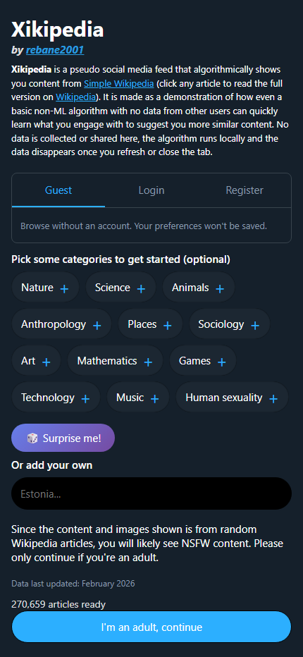

# Xikipedia

A recreation of [xikipedia.org](https://xikipedia.org/) - Wikipedia as a social media feed.

**Live at [xiki.emilycogsdill.com](https://xiki.emilycogsdill.com)**

### Mobile
| Start Screen | Feed |
|:---:|:---:|
|  |  |

### Desktop


## Attribution

**Original project by [rebane2001 (Lyra Rebane)](https://github.com/rebane2001)**

- Original repository: https://github.com/rebane2001/xikipedia
- Original site: https://xikipedia.org/

This is a learning project that recreates the original with modifications. All credit for the concept and algorithm design goes to rebane2001.

## What is Xikipedia?

Xikipedia presents Simple Wikipedia articles in an infinite-scroll feed (like TikTok or Twitter). A basic engagement-tracking algorithm learns what you like - no machine learning, no data collection, 100% client-side.

## Features

### Core
- 📱 Algorithmically curated Wikipedia content
- 🔒 Privacy-first: all data stays in your browser
- ☁️ Zero backend: runs entirely client-side
- 🧠 No ML required: simple weighted scoring

### Algorithm Controls
- 🎚️ **Algorithm Slider** - Control preference strength (0-100%)
- 🎲 **Explore Mode** - Pure random content discovery
- ⏱️ **Time-Based Decay** - Old preferences fade naturally
- 🚫 **No Repeats** - Never see the same article twice

### Anti-Filter-Bubble
- ✨ **Serendipity Injection** - Random posts every 5-10 articles
- 🎰 **Category Roulette** - Boosts unexplored topics
- 🔄 **Variety Enforcement** - Forces topic switches

### UX Features
- ⌨️ **Keyboard Shortcuts** - Full keyboard navigation
- 📜 **Reading History** - View last 50 articles
- 👍👎 **More/Less Buttons** - Fine-tune preferences
- 📲 **Pull-to-Refresh** - Mobile-friendly refresh
- 🌙 **Dark/Light Mode** - Persistent theme

### Account Features
- 🔐 **Optional Login** - Create an account to sync preferences
- ☁️ **Cloud Sync** - Preferences persist across devices
- 👤 **Guest Mode** - Use without an account (local storage only)
- 🗑️ **Account Deletion** - Full control over your data

### Offline Support
- 📴 **Service Worker** - Works offline after first load
- 💾 **Smart Caching** - Data cached for instant access
- 🔄 **Silent Updates** - Service worker auto-updates on deploy
- 📱 **PWA** - Installable as a native app

### Performance
- ♻️ **DOM Pruning** - Caps feed at 50 posts, removes offscreen elements
- 🎯 **Scroll-Driven Rendering** - Zero CPU when idle (no perpetual rAF loop)
- 🔧 **WebWorker Algorithm** - Scoring runs off the main thread

### Accessibility
- 🔔 **ARIA Live Regions** - Screen readers announce toasts and errors
- 🎬 **Reduced Motion** - Respects `prefers-reduced-motion` for all animations
- ⌨️ **Full Keyboard Support** - Navigate and interact without a mouse

### Security
- 🔒 **Security Headers** - X-Frame-Options, CSP, Referrer-Policy
- 🛡️ **Rate Limiting** - Brute-force protection on auth endpoints
- ⏱️ **Timing-Safe Auth** - Constant-time password comparison

### Keyboard Shortcuts
| Key | Action |
|-----|--------|
| `J` / `K` | Navigate posts |
| `L` | Like current post |
| `M` / `N` | More / Less like this |
| `O` / `Enter` | Open on Wikipedia |
| `R` | Refresh feed |
| `E` | Toggle explore mode |
| `A` | Cycle algorithm strength |
| `H` | Toggle history |
| `S` | Toggle sidebar |
| `?` | Show help |

## Tech Stack

| Component | Technology |
|-----------|------------|
| Hosting | Cloudflare Workers |
| Data Storage | Cloudflare R2 |
| Auth Database | Cloudflare D1 (SQLite) |
| Frontend | Vanilla JavaScript |
| Styling | CSS (no frameworks) |
| Testing | Playwright |

## Architecture

```
┌─────────────────────────────────────────┐
│         Cloudflare Workers              │
├─────────────────────────────────────────┤
│  ┌────────────┐    ┌──────────────────┐ │
│  │ Static     │    │ Worker (src/)    │ │
│  │ Assets     │    │ Proxies R2 data  │ │
│  │ (public/)  │    │                  │ │
│  └────────────┘    └──────────────────┘ │
│         │                  │            │
│         ▼                  ▼            │
│  index.html,        smoldata.json       │
│  favicon.ico        (215MB from R2)     │
└─────────────────────────────────────────┘
```

## Development

```bash
# Install dependencies
npm install

# Run type check
npm run typecheck

# Deploy to Cloudflare Workers
npm run deploy

# Run tests against production
npm test
```

### Testing

Tests run against localhost by default, or against production via environment variable:

```bash
# Against localhost (requires wrangler dev)
npm test

# Against production
PLAYWRIGHT_BASE_URL=https://xikipedia.emily-cogsdill.workers.dev npx playwright test
```

> **Note:** Some tests are skipped on production (rate limiting, internal state APIs). These require localhost with `wrangler dev` running.

## Data Updates

Data is refreshed automatically via a **Dagster pipeline** running on a local WSL2 instance.

### Schedule
- **Monthly** on the 1st at 6:00 AM (Mountain Time)
- Syncs from [xikipedia.org](https://xikipedia.org) (~2 min)

### Pipeline Flow
```
raw_wikipedia_data         Download from xikipedia.org (~40MB compressed)
        ↓
processed_wikipedia_data   Validate & transform (~270K articles)
        ↓
r2_wikipedia_data         Upload to Cloudflare R2 (~215MB)
```

### Manual Update
- **Dagster UI**: http://pceus:3000 → Jobs → `xikipedia_update_job` → Launch Run
- **CLI**: `dagster job launch -j xikipedia_update_job -f dagster_definitions/definitions.py`

### Setup
See [dagster_definitions/SETUP.md](./dagster_definitions/SETUP.md) for installation and configuration.

## Full Wikipedia Data Generation

For full English Wikipedia support (~6.8M articles), we use a chunked data format:

### Quick Start (Test Mode)
```bash
# Generate test data (100 articles)
npm run generate-test-data

# Or with custom limit
node scripts/generate-chunked-data.mjs --test --test-limit 10000
```

### Full Generation Process

1. **Download Wikipedia Dump** (~21GB compressed)
```bash
wget https://dumps.wikimedia.org/enwiki/latest/enwiki-latest-pages-articles.xml.bz2
```

2. **Generate Chunked Data** (takes 4-8 hours)
```bash
node scripts/generate-chunked-data.mjs --dump enwiki-latest-pages-articles.xml.bz2
```

3. **Resume if Interrupted** (partial support)
```bash
node scripts/generate-chunked-data.mjs --dump enwiki-latest-pages-articles.xml.bz2 --resume
```
> ⚠️ **Note:** Resume currently restores counters and chunk position but does not restore the accumulated index state (pages, categories). This means `index.json` will only contain articles processed after resumption. For a complete index, run the full generation without interruption or re-process from the beginning.

### Output Structure
```
public/full-wiki/
├── index.json       # Article index (~80-100MB compressed)
├── checkpoint.json  # Resume state
└── articles/
    ├── chunk-000000.json.br  # Articles with pageId 0-9999
    ├── chunk-000001.json.br  # Articles with pageId 10000-19999
    └── ...                   # ~680 chunk files total
```

### Data Schema

**index.json** - Lightweight index for fast searching:
```javascript
{
  version: "2.0.0",
  articleCount: 6800000,
  chunkSize: 10000,
  chunkCount: 680,
  pages: [
    // Tuple format: [title, pageId, chunkId, thumbHash, categories]
    ["Article Title", 12345, 1, "abc12345", ["science", "physics"]],
    ...
  ],
  subCategories: { "science": ["physics", "chemistry"], ... },
  noPageMaps: { "12345": "article title", ... }
}
```

**chunk-NNNNNN.json** - Article content:
```javascript
{
  chunkId: 1,
  articleCount: 10000,
  articles: {
    "12345": { text: "Article intro text...", thumb: "Image.jpg" },
    ...
  }
}
```

### Requirements
- Node.js 20.18.1+ 
- `bunzip2` for decompression (pre-installed on Linux/Mac)
- ~50GB free disk space
- ~4-8 hours processing time

## License

This recreation follows the original project's licensing. Wikipedia content is CC BY-SA.

## See Also

- [DESIGN.md](./DESIGN.md) - Technical architecture and implementation details
